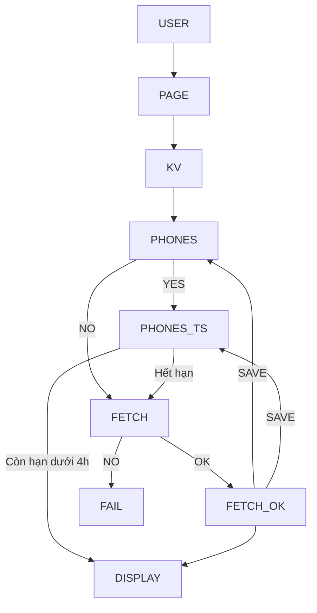

# cf-worker-call-redirect-docs

```mermaid
flowchart TD
USER --> PAGE --> KV --> PHONES --> |YES| PHONES_TS --> |"Còn hạn dưới 4h"| DISPLAY

PHONES -->|NO| FETCH --> |OK| FETCH_OK

PHONES_TS --> |"Hết hạn"| FETCH

FETCH --> |NO| FAIL

FETCH_OK --> |SAVE| PHONES
FETCH_OK --> |SAVE| PHONES_TS
FETCH_OK --> DISPLAY

```
